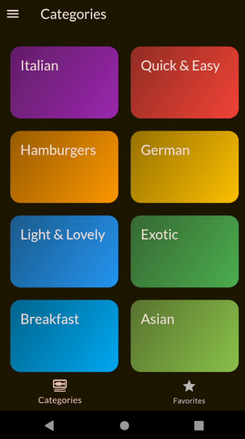

# Meals

A meals app using Riverpod

It includes:
- Meals
- Filters
- Riverpod for State Management
- Theme
  
#### App Screenshots

<table>
  <tr>
    <td>Categories Screen</td>
     <td>Meals Screen</td>
     <td>Meals Details Screen</td>
  </tr>
  <tr>
    <td></td>
    <td></td>
    <td></td>
  </tr>
   
  <tr>
    <td>Filters Screen</td>
     <td>Favorites Screen</td>
     <td>Drawer</td>
  </tr>
  <tr>
    <td></td>
    <td></td>
    <td></td>
  </tr>
 </table>
